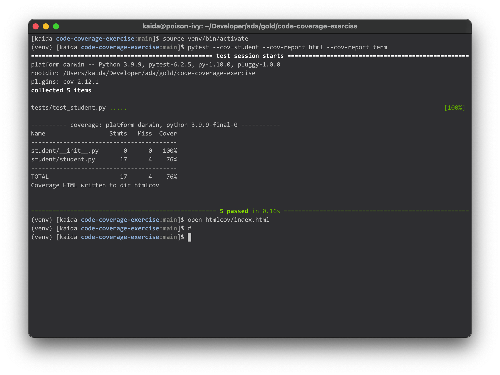
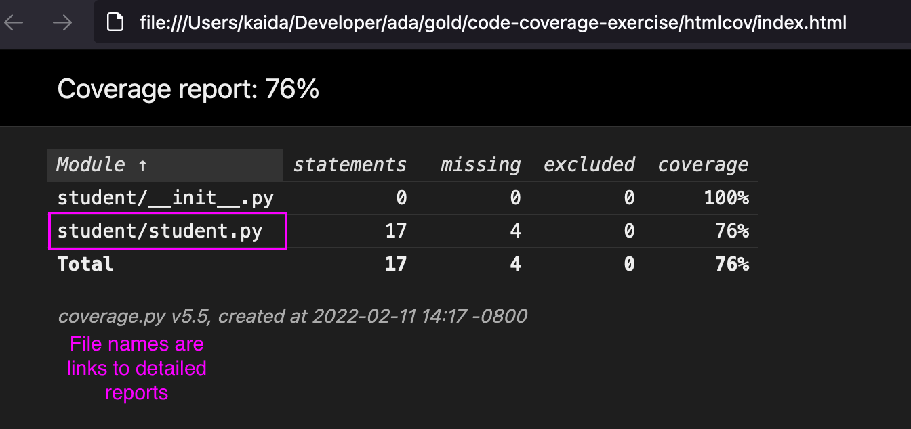
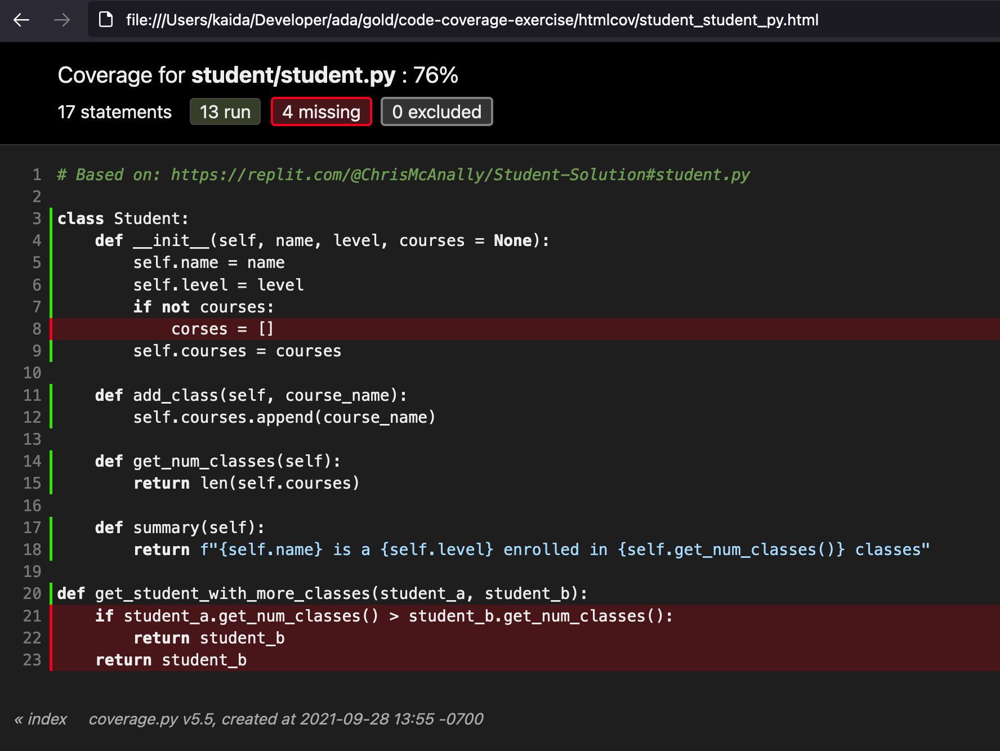

# Code Coverage Exercise #

In this exercise you will work with your group to get to full code coverage and fix any bugs that you find.

## Setup
1. In Github, click on the "Fork" button in github and fork the repository to your Github account. This will make a copy of the project in your github account.

2. In Github, add the other member(s) of your team as collaborators to the repository. Do this by a The student who forked the respository should first choosing Settings from the top menu bar, then Manage access from the left navigation, and finally Invite teams or people.

3. Clone a copy of this exercise. This command makes a new folder called `code-coverage-exercise`, and then puts the exercise into this new folder.

```bash
git clone ...
```

Use `ls` to confirm there's a new project folder

4. Move your location into this project folder

```bash
cd code-coverage-exercise
```

5. Create a virtual environment named `venv` for this project:

```bash
python3 -m venv venv
```

6. Activate this environment:

```bash
source venv/bin/activate
```

Verify that you're in a python3 virtual environment by running:

- `$ python --version` should output a Python 3 version
- `$ pip --version` should output that it is working with Python 3

7. Install dependencies once at the beginning of this exercise with

```bash
# Must be in activated virtual environment
pip install -r requirements.txt
```

8. Exit and re-enter the virtual enviornment with the following command. This is needed to ensure the correct version of pytest is used in the terminal.

```bash
deactivate && source venv/bin/activate
```

## Checking Code Coverage

To check the code coverage you can run:
```
pytest --cov=student --cov-report html --cov-report term
```

To see the detailed report (after running the above) you can open it in your default browser with:

```
open htmlcov/index.html
```

The above commands need to be run from the root folder of the project.

*Running the commands in the terminal:*


Once you've loaded the detailed report you can click on the file names to see information about what lines are missing code coverage.

*The front page of the detailed report:*


*The details for student/student.py:*


The lines with coverage have a green line by their line number, the lines without coverage have a red one and a highlighted background.

To read more about pytest-cov you can consult the [pytest-cov documentation](https://pytest-cov.readthedocs.io/en/latest/).
